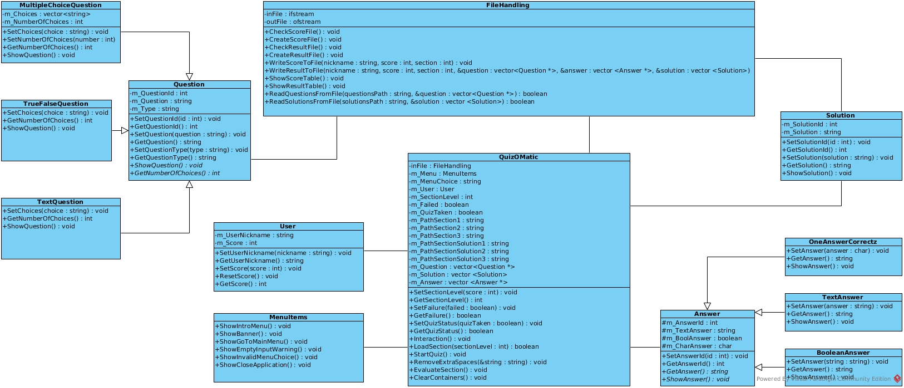
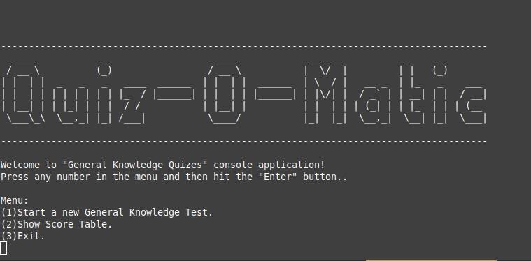
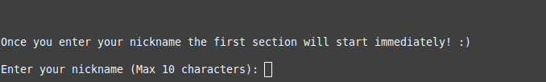
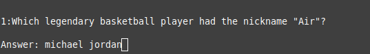
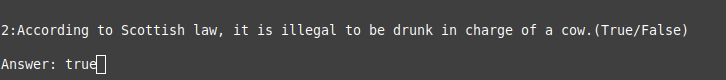
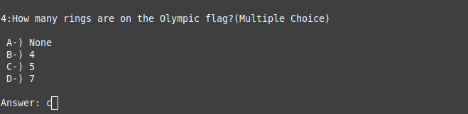
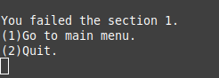
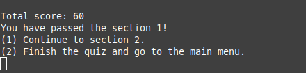
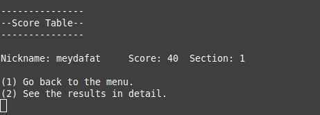
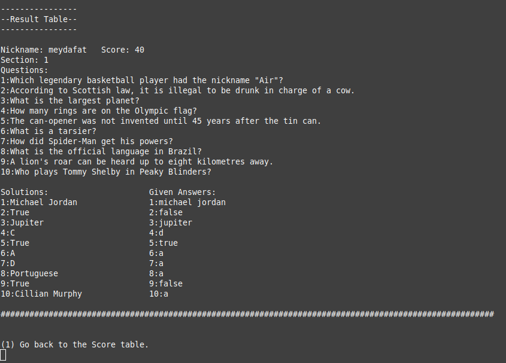

A quizzes console application that reads questions and solutions from file. User interracts with the application by solving quizzes, cancel or continue to further sections, show score and detailed result board. 

Program contains 3 sections and each section has mixed type 10 questions. Based on answers user can fail a section if user gets less than 50 points. Otherwise sections pass (maximum section 3).

Every section contains different type of questions and answers. User can type text answer to the text question, makes true false decision on boolean questions and picks an choice between multiple choice questions. The program contains simple polymophism based on this idea.

Also there is impelemented a menu system which user can navigate and reach their score through the score table and detailed section. When program runs for the first time on a new computer it creates score and result files automatically.

There is used special format in the question files to distinguish different type of questions and store them in to related containers. Program checks for simple word and character combinations to determine the question types.

To start the application you need to build it first with the command "make" on terminal in the directory of Quizzes.

Then in the same directory you run:

    ./quizzes

If you do not see your result after each section by checking the score board, then you need to run the application as a super user to be able to write your score to the related text files.

Class Diagram
-----------------------------------------------------------------------------

Screen Shots
-----------------------------------------------------------------------------
1-You can start to navigate within the program by entering the appeared choices.

2-By entering a nickname you are ready to start the quiz.

3-Program waits for a text format answer from you. You don't have to worry about capital or small letter.

4-For True/False questions you can enter in the following formats:

    'T','t',"true" for True or 'F','f',"FALSE" for False answer.
    

5-For multiple choice questions program waits for a character that appears in the choices.

6-Each section contains 10 questions. If your right answer are less than 5, then you fail the section.

7-If your right answers are more than 5, you can go for the next section unless it is the last section.

8-You can check the score table where you can see your nickname and the points you have got.

9-Also you can see you result in details.

-----------------------------------------------------------------------------